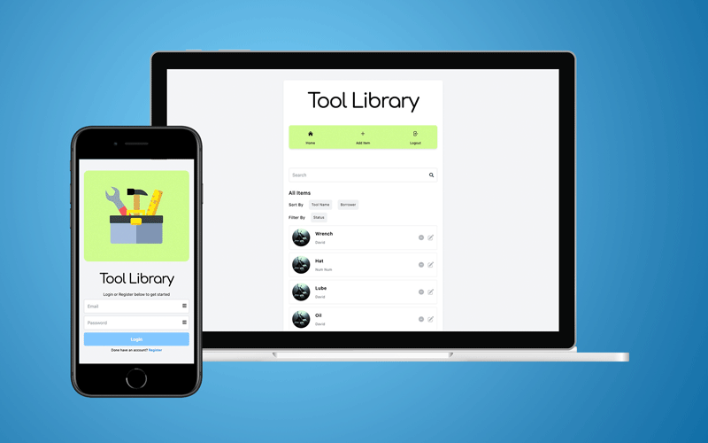

# Tool Loaner App

Why get frustrated trying to remember if you loaned your tools out again? Tool Library is a full-stack app that automatically tracks all the items in your tool inventory and you can see who has what. Forget about writing up a list on paper or trying to remember who you lent to; just use Tool Library and never worry about it again.
 
 

 
 

 
 

## Development

### Technologies Used

Front end

- ReactJS
- JavaScript
- Tailwind

Backend

- MongoDB
- NodeJS
- Express
- Bcrypt Encryption
- JWT Authentication

### `npm start`

Runs the app in the development mode.
Open [http://localhost:3000](http://localhost:3000) to view it in your browser.

You will also need to run the backend server by running node app.js after cloning and downloading https://github.com/wongstephen/toolloaner-backend

The page will reload when you make changes.

### Entity Relationship Diagram

### Updates

- 02/03/2023 Update summmary: Updates made to background and edit functionality. Added avatar for edit and tools. Localhost removed from API and confirm password feature added. Login redirected when no token is present and updated auth in mid-app. Deleted user tools and updated homepage. Google analytics and adsense added, loading screens added for inventory and login/registration. Private routes added and components organized for better functionality. Edit items feature added and loanee removed on click. Search and sort added to inventory, heroic icons added and styling updated with Tailwind. Connected frontend to live backend and updated signout page. Add Item component connected to backend and tests added for register. Feed connected to backend and updated with context for auth. Basic tests added.
- 10/3/2022 Added check for duplicate email
- 10/5/2022 Added Updated Routes

### Future Updates

- Forget password
- Host backend on AWS
- Relationship Schema for Loanee
- Additional test for user login
- Password requirements
- Store data into useContext to reduce API calls
